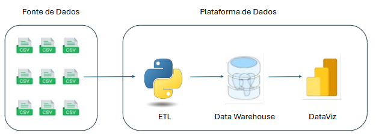
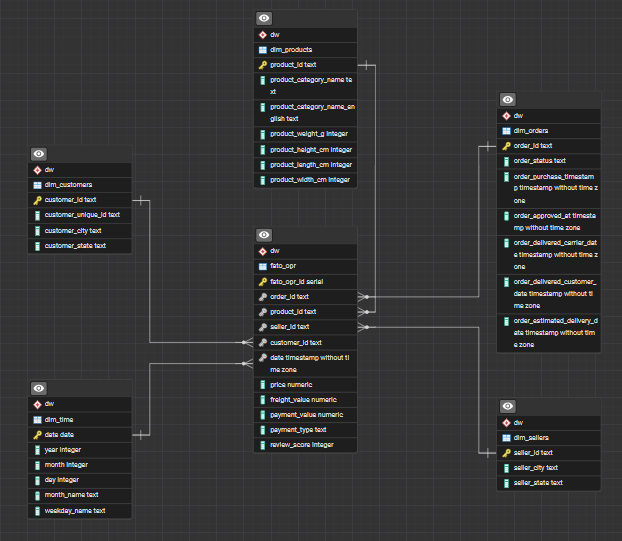
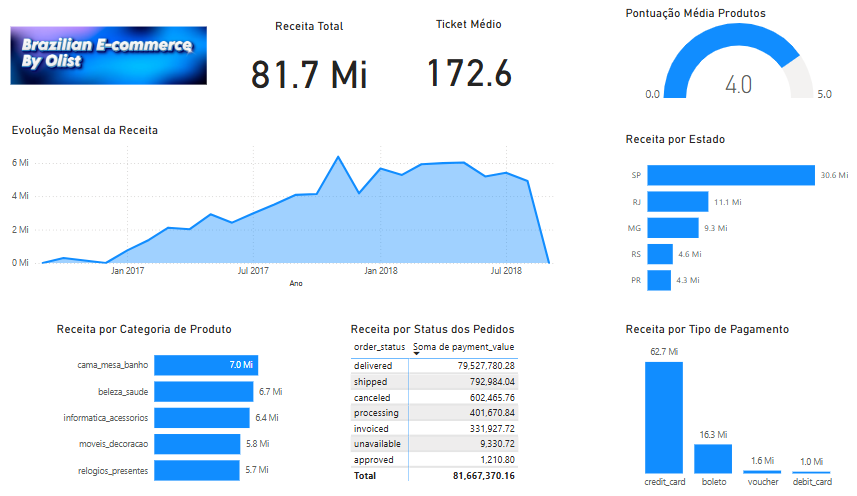

# triggo.ai challenge
1. Teste Técnico - Programa Trainee triggo.ai de Excelência em Engenharia de Dados e DataOps 2025.  
2. Projeto final unidade 3, Módulo `Python`, Digital College Brasil.

[Repositório com as instruções no GitHub.](https://github.com/Triggo-ai4/desafio-data-engineer?utm_campaign=testes_-__programa_trainee_1_edicao_-_reenvio&utm_medium=email&utm_source=RD+Station)

## Objetivo
Analisar o conjunto de dados históricos de vendas para extrair insights valiosos que possam ajudar nas decisões estratégicas do negócio.

## Dataset
"Brazilian E-commerce Public Dataset by Olist" disponível no Kaggle. Este dataset contém informações sobre 100.000 pedidos de e-commerce no Brasil realizados entre 2016 e 2018.

[Link para o dataset no Kaggle.](https://www.kaggle.com/datasets/olistbr/brazilian-ecommerce)

## Arquitetura do projeto
  

## Etapas do projeto
- [Análise exploratória dos dados](./jupyter_notebook_files/exploratory_1.ipynb) - Passos disponíveis no arquivo jupyter notebook.
- [Tratamento dos dados](./jupyter_notebook_files/treatment_load_2.ipynb) - - Passos disponíveis no arquivo jupyter notebook.

- [Elaboração do Data Warehouse](./sql/postgres.sql) - Passos disponíveis no arquivo sql.  
  

- Visualização e Dashboards
  

### Meus contatos
- LinkedIn - [renato-malbuquerque](https://www.linkedin.com/in/renato-malbuquerque/)
- GitHub - [renato-albuquerque](https://github.com/renato-albuquerque)
- Discord - [Renato Albuquerque#0025](https://discordapp.com/users/992621595547938837)
- Business Card - [Renato Albuquerque](https://rma-contacts.vercel.app/)